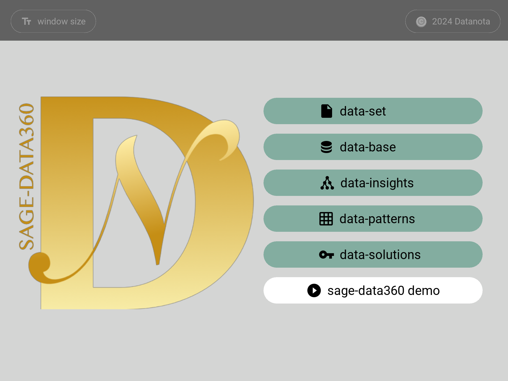
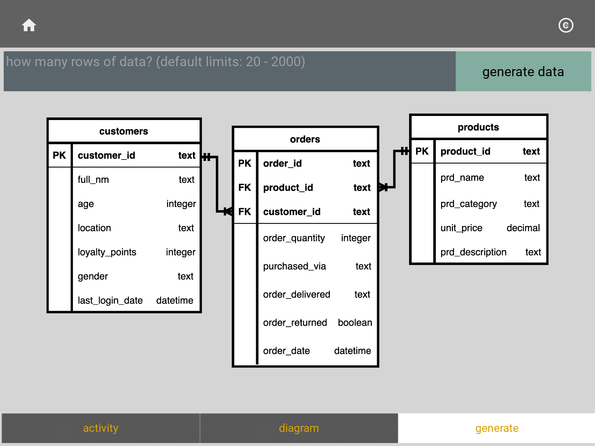
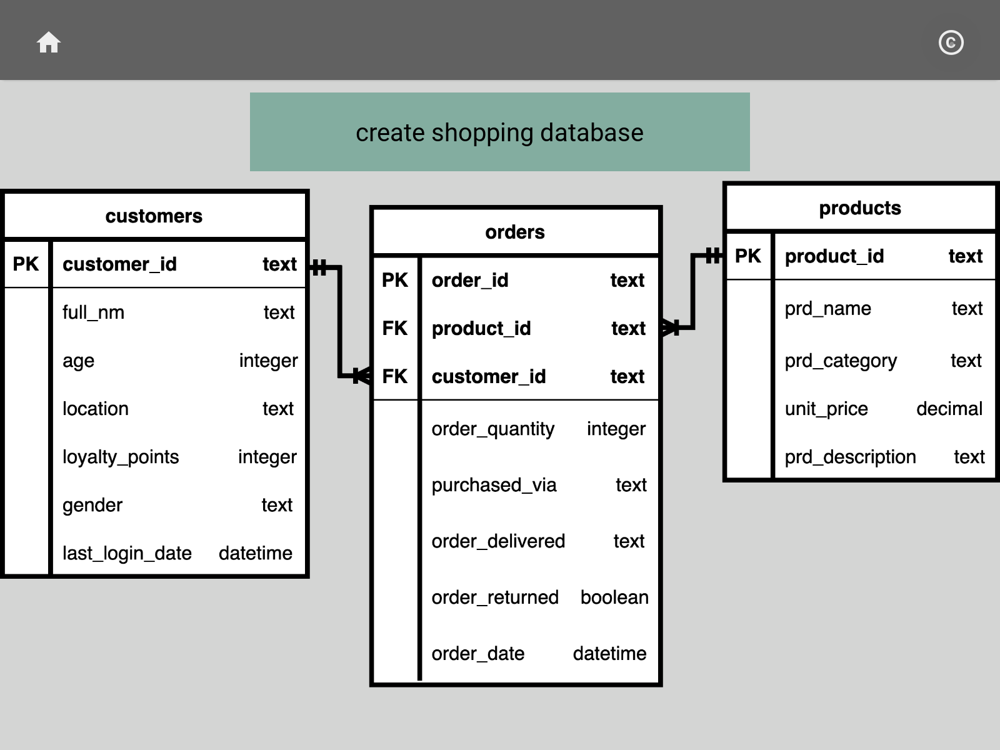
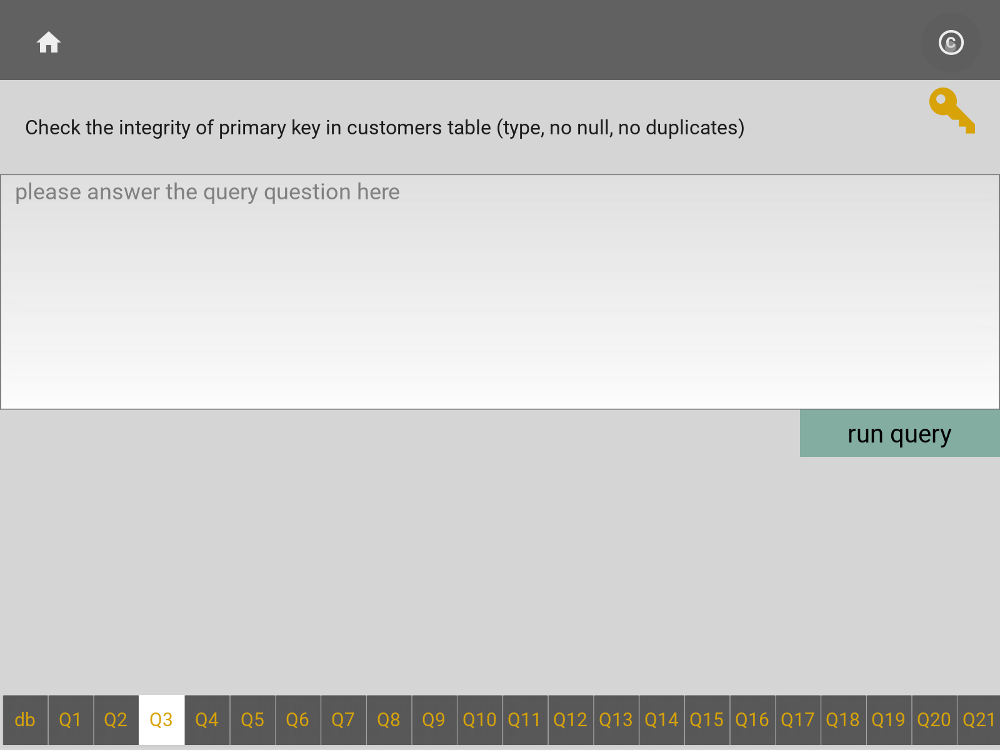
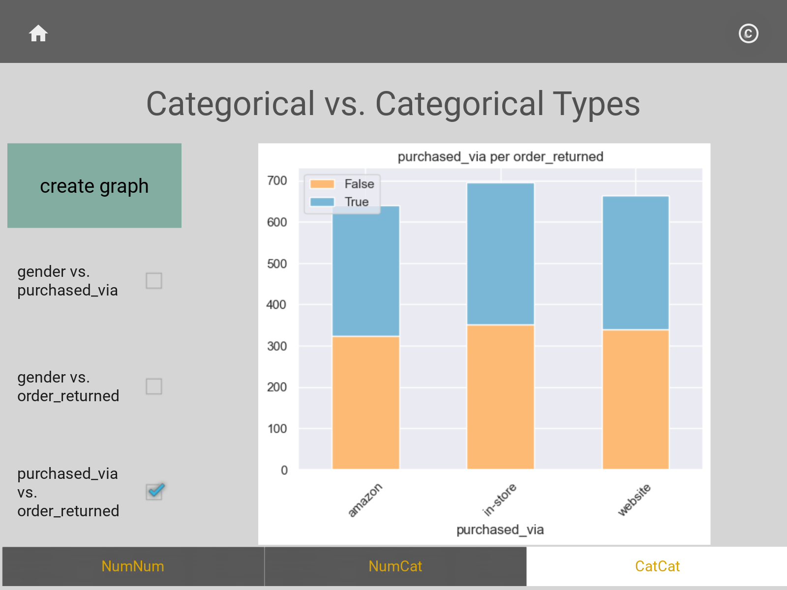

# Datanota SAGE - DATA360
## Version-1.1

 

 

## dataset: 

    generate shopping data

## database: 

    create shopping database 

## insights: 

    Q & A SQLite3 queries with answer keys 

## patterns: 

    numerical vs. numerical type
    numerical vs. categorical type
    categorical vs. categorical type

## solutions
Solutions for DataFrames and Databases with the SAGE shopping dataset
