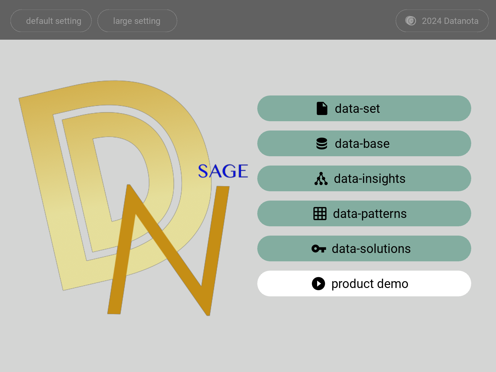
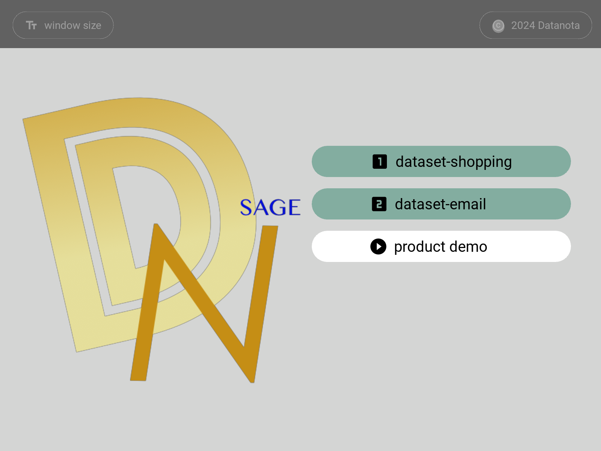
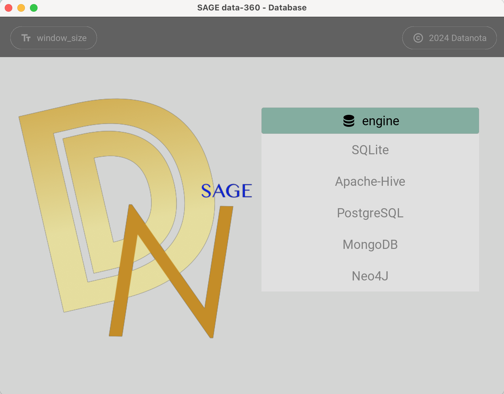
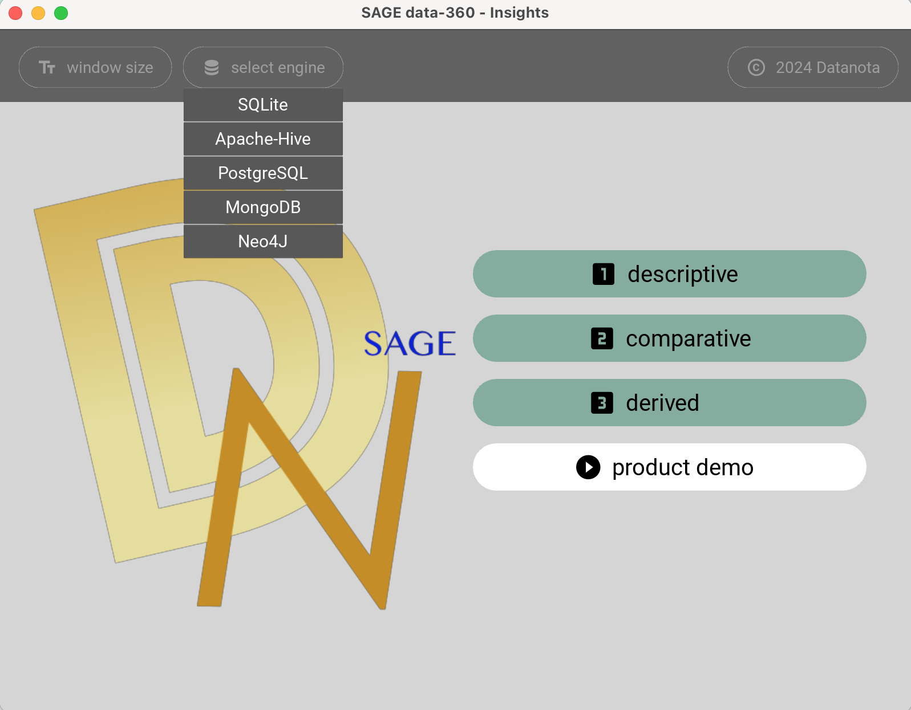
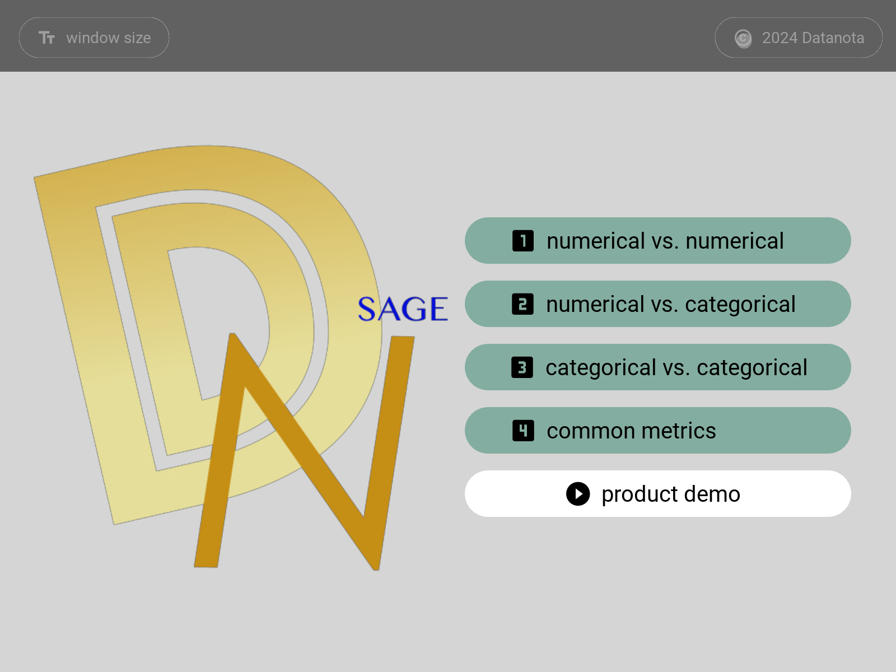
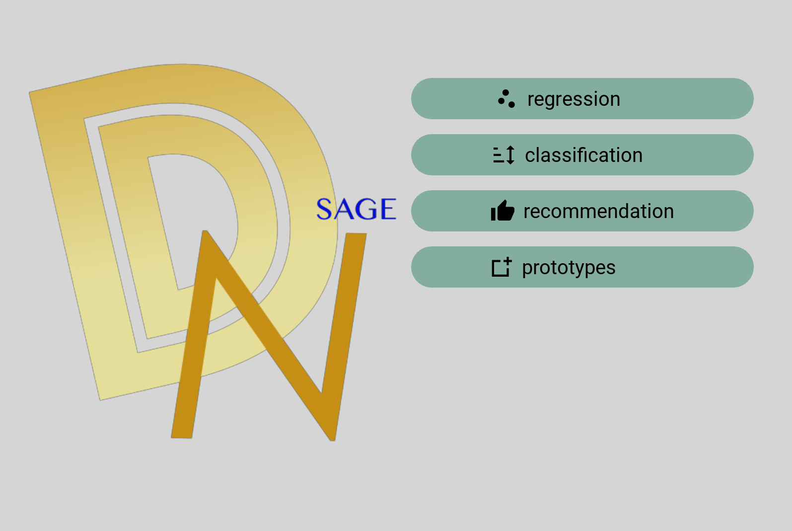

# Datanota SAGE - data-360

    - sage data-360 has five sections (dataset, database, insight, pattern and solution)
    - in-detail docstrings

 

 

## dataset

    step(1): choose a dataset to design and generate (e.g. shopping, email)

    step(2): review the activity and data diagram
    
    step(3): provide the number of rows of data and press generate

 

## database

 

## insight

    step(1): from the ToolBar left-side dropdown buttons:

        - select app window size (default 800*600)
        - select query engine (default SQLite3)
    
    step(2): choose a sage-insights section (descriptive, comparative or derived query types)

    step(3): each sage-insights section has 10 questions with answer keys 

 

## pattern

    step(1): from the ToolBar left-side dropdown buttons select app window size (default 800*600)

    step(2): choose a sage-pattern section (numerical vs. numerical, categorical or common metrics)

    step(3): each sage-pattern section has visuals and related concepts

 

## solution and prototypes

### Amber: stock ROI calculator

    algorithm: 
        simple weighted average calculator
    database: 
        1. an Excel file is the data source
        2. given a stock ticker, lists stock information
    buy: 
        given a dollar amount (default value is $1000)
            1. to calculate quantity per stock (considering current price)
            2. to calculate percentage change in weighted average price if invested
            3. to sort from smallest to largest
    sell: 
        given a dollar amount (default value is $1000)
            1. find the oldest transaction
            2. list the oldest unit_price and quantity
            3. calculate percentage change in weighted average after selling the oldest entry

 

