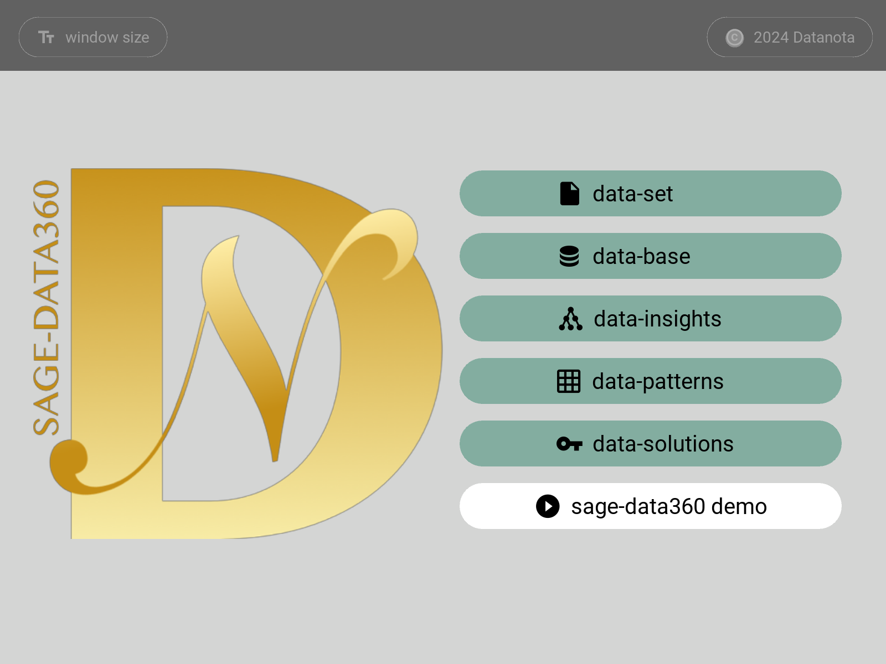
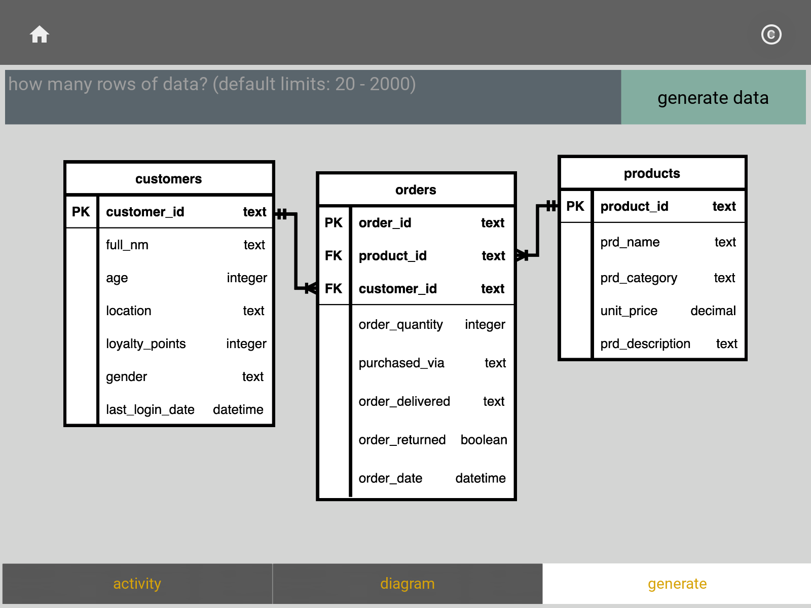
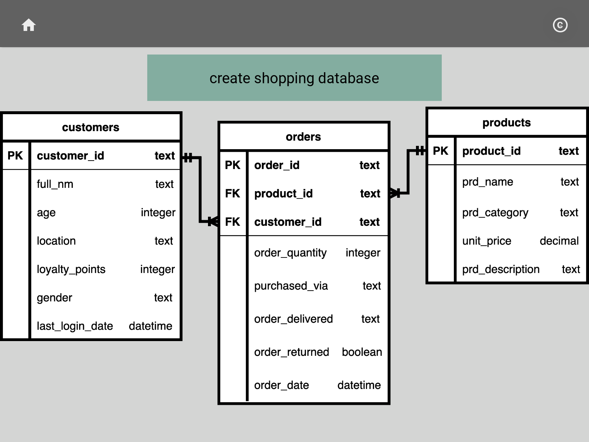
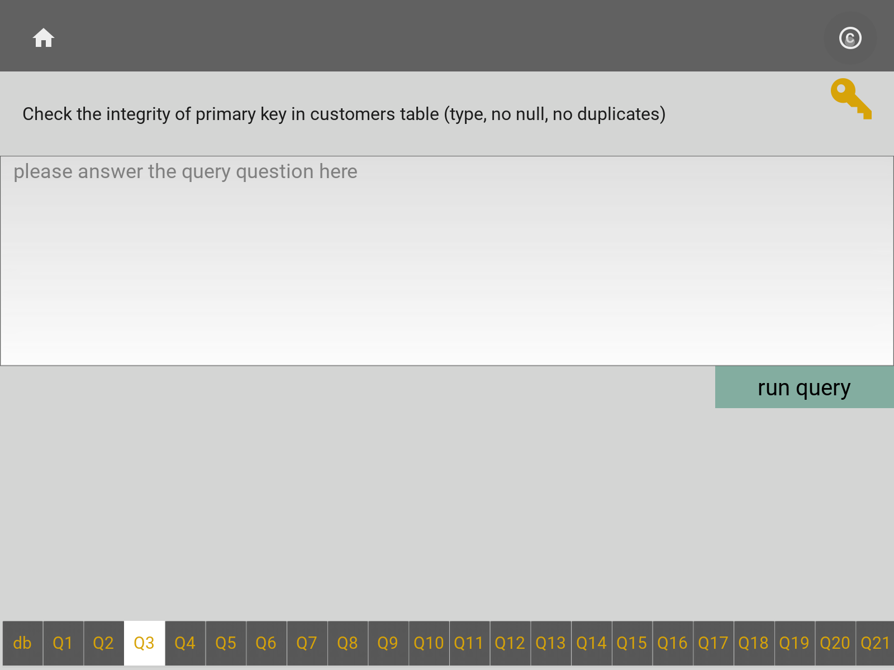
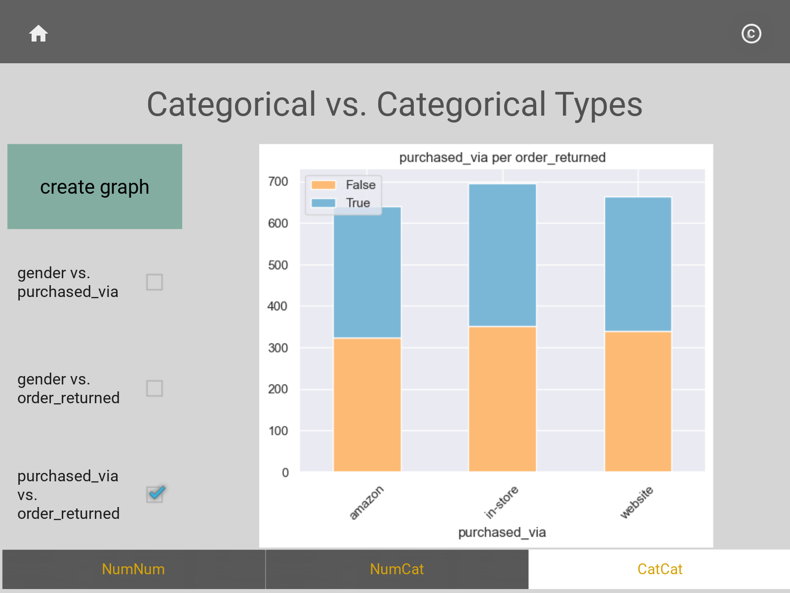
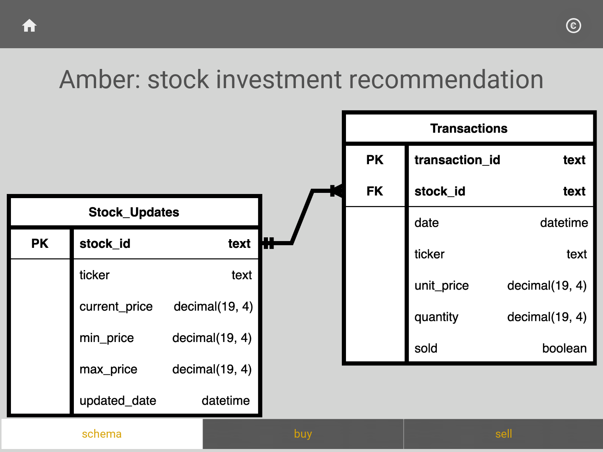

# Datanota SAGE - DATA360
## Version-1.1

 

 

## dataset: 

    generate shopping data

## database: 

    create shopping database 

## insights: 

    Q & A SQLite3 queries with answer keys 

## patterns: 

    numerical vs. numerical type
    numerical vs. categorical type
    categorical vs. categorical type

## solutions

    Amber: stock investment recommendation
        algorithm: 
            simple weighted average calculator
        database: 
            1. an Excel file is the data source
            2. given a stock ticker, lists stock information
        buy: 
            given a dollar amount (default value is $1000)
                1. to calculate quantity per stock (considering current price)
                2. to calculate percentage change in weighted average price if invested
                3. to sort from smallest to largest
        sell: 
            given a dollar amount (default value is $1000)
                1. find the oldest transaction
                2. list the oldest unit_price and quantity
                3. calculate percentage change in weighted average after selling the oldest entry

